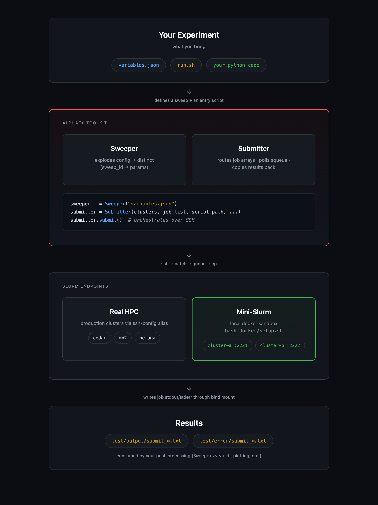

<div align="center">


# Run and sweep thousands of experiments across SLURM clusters

[](https://github.com/dantp-ai/AlphaEx/actions/workflows/ci.yml)
[](https://codecov.io/gh/dantp-ai/AlphaEx)

[**Submitter**](#submitter) | [**Sweeper**](#sweeper) | [**Install**](#install) | [**Local sandbox**](#local-sandbox-mini-slurm) | [**Citation**](#citation)
</div>

## What is AlphaEx
---

AlphaEx is a small Python toolkit for managing large numbers of experiments. It does two things:

- **Submitter** - automatically distributes and reschedules SLURM array jobs across multiple clusters, respecting per-cluster capacity, then copies results back.
- **Sweeper** - expands a single JSON spec into every combination of your experiment variables, indexed for one-click sweeps and post-hoc result lookup.

Each is a self-contained module: `alphaex/submitter.py` and `alphaex/sweeper.py`.

<p align="center"></p>

> Sweeper runs anywhere with Python. Submitter requires [SLURM](https://slurm.schedmd.com/overview.html) - access to at least one SLURM cluster, or the Docker [local sandbox](#local-sandbox-mini-slurm).

## Installation
---

Requires Python >= 3.9 (3.12 recommended) and numpy >= 2.0.

```bash
git clone https://github.com/dantp-ai/AlphaEx.git
cd AlphaEx
pip install -e .          # or: uv venv --python 3.12 && uv pip install -e .
```

## Submitter

Given `N` jobs and a few clusters of differing speed and job limits, `Submitter` keeps every cluster filled to capacity, polls for completions, submits replacements until all jobs are done, then copies results back to the server.

```python
from alphaex.submitter import Submitter

clusters = [
    {"name": "cedar", "capacity": 3, "account": "def-account",
     "project_root_dir": "/home/userA/.../AlphaEx",
     "exp_results_from": ["/home/userA/.../AlphaEx/test/output"],
     "exp_results_to": ["test/output"]},
]
job_list = [(1, 4), 6, (102, 105), 100]   # (1, 4) expands to 1,2,3,4

Submitter(
    clusters, job_list, script_path="test/submit.sh",
    export_params={"python_module": "test.my_experiment_entrypoint",
                   "config_file": "test/cfg/variables.json"},
    sbatch_params={"time": "00:10:00", "mem-per-cpu": "1G"},
    repo_url="https://github.com/dantp-ai/AlphaEx.git",
    duration_between_two_polls=60,
).submit()
```

`export_params` / `sbatch_params` let one generic `submit.sh` serve many experiments. The runnable example is `test/test_submitter.py` (reads `ALPHAEX_PROJECT_ROOT`, `ALPHAEX_ACCOUNT`, `ALPHAEX_REPO_URL` from the environment).

> **Tip:** the server must stay online while polling - run it on a cluster login node under `tmux`, not a laptop.

<details>
<summary>SSH setup (passwordless cluster access)</summary>

Submitter reaches clusters via `ssh <cluster name>`, so configure key-based access first:

```bash
ssh-keygen
ssh-copy-id <username>@<cluster url>
```

Then add each cluster to `~/.ssh/config`:

```
Host *
    AddKeysToAgent yes
    IdentityFile ~/.ssh/id_rsa

Host <cluster name>
    HostName <cluster url>
    User <username>
```
</details>

<details>
<summary>Example array-job script (<code>test/submit.sh</code>)</summary>

```bash
#!/bin/bash
#SBATCH --output=test/output/submit_%a.txt
#SBATCH --error=test/error/submit_%a.txt

export OMP_NUM_THREADS=1
module load python/3.12

python -m "${python_module}" "${SLURM_ARRAY_TASK_ID}" "${config_file}"
```

`SLURM_ARRAY_TASK_ID` is assigned by Submitter; output lands in `test/output/submit_<id>.txt`.
</details>

## Sweeper

Define every variable combination - algorithms, simulators, parameters - in one JSON file. `cfg/variables.json` is a full example.

Three rules for the file:
1. Start with a dictionary, not a list.
2. Lists and dictionaries alternate when nested.
3. Each combination draws one element from every list and all elements from every dictionary.

```python
from alphaex.sweeper import Sweeper

sweeper = Sweeper("test/cfg/variables.json")
sweeper.total_combinations                 # number of distinct combinations
cfg = sweeper.parse(idx)                   # combination (+ run number) for a sweep index
hits = sweeper.search({"param1": "param1_3", "param4": True}, num_runs=10)
```

- `parse(idx)` maps a flat index to one variable combination - drive your sweep by iterating `range(total_combinations * num_runs)`.
- `search(search_dict, num_runs)` returns all combinations matching `search_dict` (keys not in the sweep are ignored) with their indices - handy for collecting results after a run.

`test/test_sweeper.py` is a complete runnable example.

## Local sandbox (mini-slurm)

`docker/` ships a two-cluster SLURM sandbox so you can drive Submitter end-to-end over SSH without an HPC account. Requires Docker with `docker compose`.

```bash
bash docker/setup.sh                                          # build, start, wire ~/.ssh/config
ALPHAEX_LOCAL_SLURM=1 uv run pytest test/test_submitter_local.py -v
ls test/output/                                               # submit_1.txt ... submit_4.txt
bash docker/teardown.sh                                       # stop containers, clean ~/.ssh/config
```

`setup.sh` generates a dedicated keypair under `docker/keys/`, adds guarded `Host cluster-a` / `Host cluster-b` blocks to `~/.ssh/config`, and publishes SSH on ports 2221/2222. The repo is bind-mounted into each container, so job output appears directly on the host. It is for developing the Submitter itself - single node per cluster, fake account, no accounting - not a substitute for a real cluster.

## Testing

```bash
uv run pytest                                  # unit tests
uv run pytest test/test_sweeper.py             # Sweeper end-to-end
```

`test/test_submitter.py` needs real cluster configuration and is excluded from the default run; use the [local sandbox](#local-sandbox-mini-slurm) instead.

## Citation

```bibtex
@misc{alphaex,
  author = {Wan, Yi and Plop, Daniel},
  title = {AlphaEx: A Python Toolkit for Managing a Large Number of Experiments},
  year = {2019},
  publisher = {GitHub},
  journal = {GitHub Repository},
  howpublished = {\url{https://github.com/AmiiThinks/AlphaEx}},
}
```
